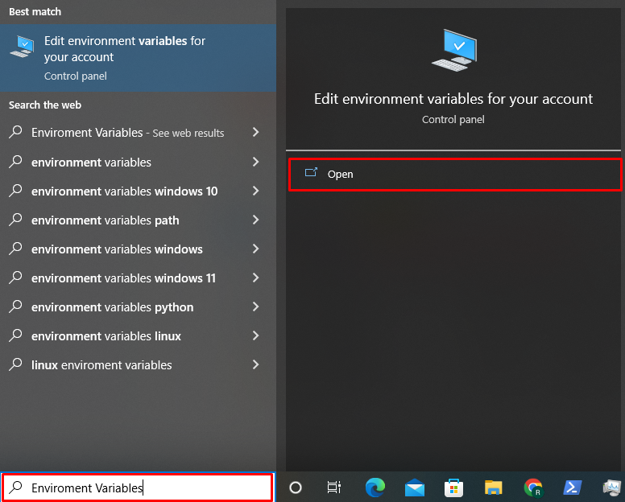
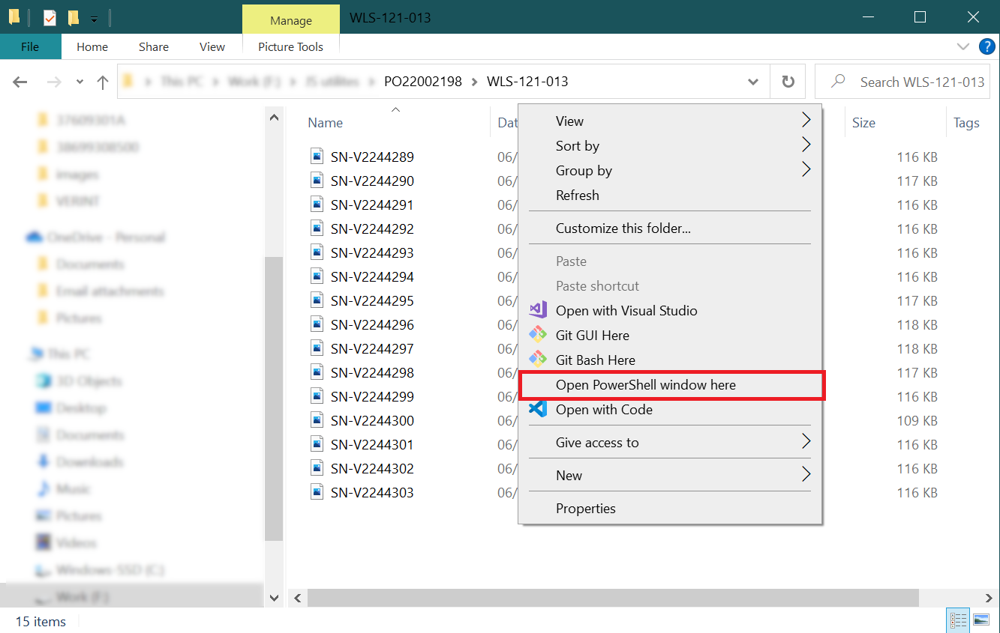
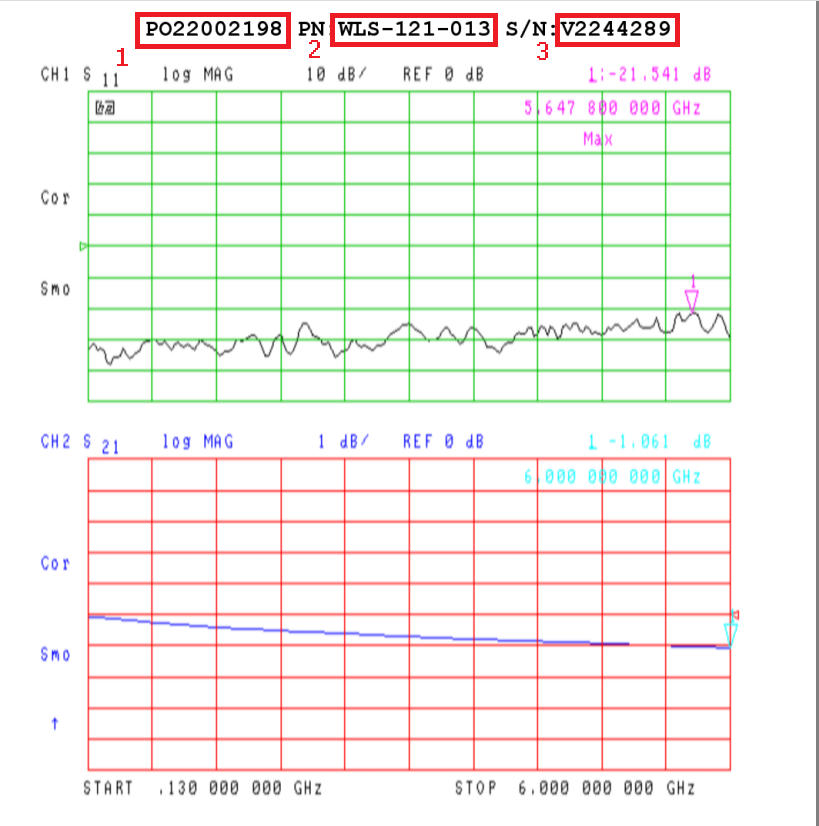
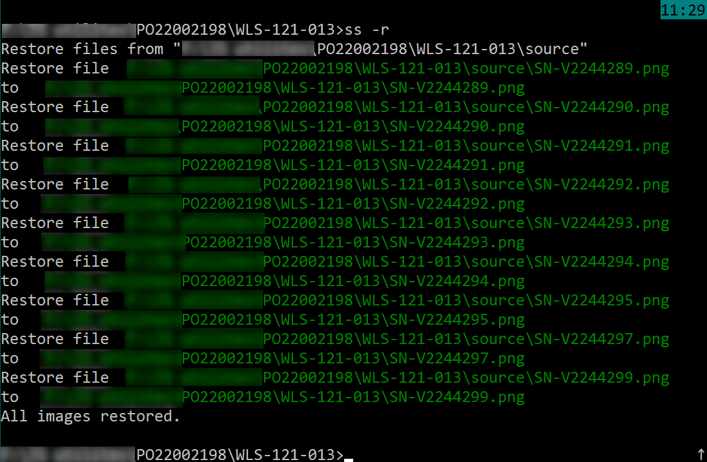

# Sign & Merge

#### Make sign for all .png files in directory.
#### Merge files __*-ch1.png__ and __*-ch2.png__ to one with both markers list.
***
## Require

[Node.js](https://nodejs.org/)
***
## Installation
Download and unzip this repository. Execute command in command line:
>npm install

Add project direcrtory to system PATH environment:
1. Copy the Directory path. To do so, select the path from the address bar and press “CTRL+C” 

2. Open the Environment Variables settings by typing “Environment Variables” in the “Startup” menu and selecting the “Edit environment variables for your account” option:

3. Press the “Environment Variables” button:

4. Choose the Path option from the “System variables” panel and press the “Edit” button:

5. click the “New” button to add the copied path, press “CTRL+V” to paste the directory path, and click the “OK” button:

## How to use

### Sign tests

1. Save scrinshots of test in path with format:
>PO#######/PN########/SN-#######

2. Open path from file explorer:

1 - PO; 2 - PN; 3 - SN.

3. Press Shift and right click mouse. Select “Open PowerShell window here”:

4. Type **ss** and press **Enter**:

5. After the script print: “All images signed.”:

Your screenshots in folder signed:

#### Restore unsigned files

Type **ss -r** and press **Enter**. Directory "source" must exist.

All __*.png__ files from "source" directory will moved to current folder.

### Merge tests with 2 channels

Merge files __*-ch1.png__ and __*-ch2.png__ to one with both markers list.
